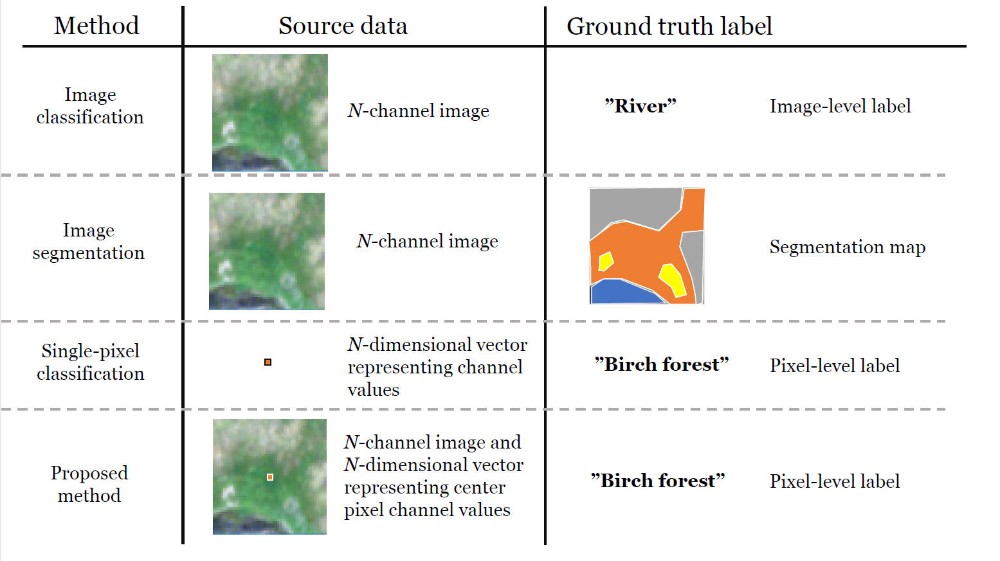

# LappiEO habitat classification

This repository contains code for classification of remote sensing imagery from point-like data.

## Features:

### Preprocessing
- Script for sampling rasters based on a `.shp`-file containing training points
- Script for sampling rasters for training batches based on a `.shp`-file containing rectangular patch areas

### Model training
- Classification of georasters with CNNs
- Classification of georasters with AutoML tools
- Semi-supervised training with Noisy Student training
- Unsupervised training with Invariant Information Clustering

This is a research repository and things can change quickly. Please don't hesitate opening an issue.

# Installation

Clone repository

```bash
git clone https://github.com/mikkoim/lappiEO.git
cd lappiEO
```

Install anaconda or miniconda, for example by
```bash
wget https://repo.anaconda.com/miniconda/Miniconda3-latest-Linux-x86_64.sh
bash Miniconda3-latest-Linux-x86_64.sh -b -p $YOUR_DIR/miniconda3
source $YOUR_DIR/miniconda3/etc/profile.d/conda.sh
```

Create conda environment

```bash
conda env create -f environment.yml
conda activate lappieo
```

Install the `lappieo` package 

```bash
pip install -e .
```

# Usage

An overview of the full workflow for classifying rasters can be found from [the workflow document](doc/workflows/00_workflow_general.md). It is designed for running on CSC clusters but can be easily modified for custom data.

The `batchjobs`-folder contains examples of running scripts for both model training and raster classification. These can also be run straight on the [CSC](https://docs.csc.fi/)-supercomputers.

# Methods

Classifications can be performed with either deep learning approaches or with random forests. These approaches can also be combined to produce better performing classifiers. The differences between approaches can be seen in the below figure:


